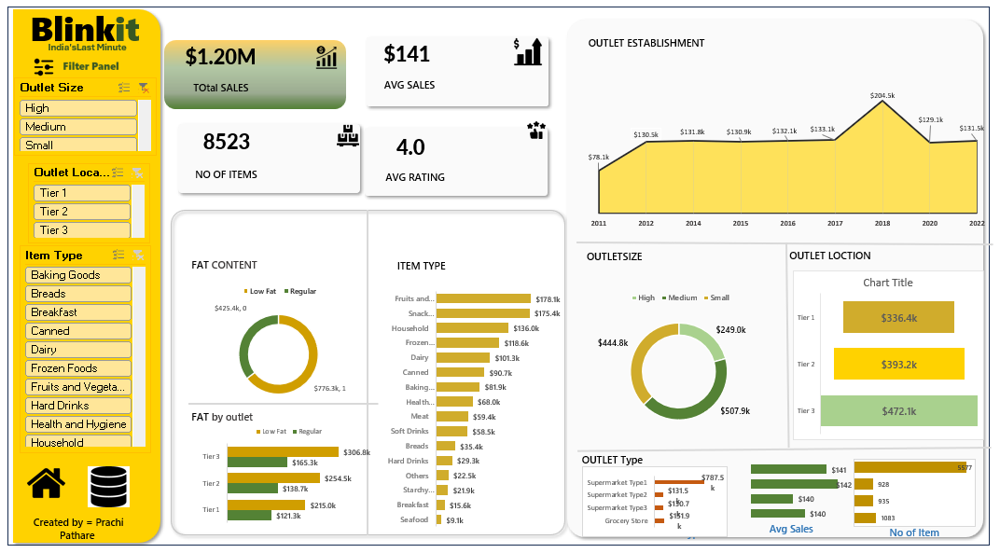

# 🛒 Blinkit Sales Analysis Dashboard

## 📌 Project Preview
This project presents an interactive sales dashboard built using Blinkit grocery data.  
It provides insights into product performance, outlet characteristics, and sales distribution to support data-driven business decisions.

The dashboard highlights key KPIs such as total sales, average sales, number of items, and average rating, along with detailed breakdowns across outlet size, location, and product categories.

## ⭐ Key Features
- KPI cards for quick business overview (Total Sales, Avg Sales, Ratings)
- Sales trend analysis based on outlet establishment year
- Product category-wise sales breakdown
- Outlet size and location performance comparison
- Fat content-based product sales analysis
- Interactive filter panel (Outlet Size, Location, Item Type)

## 🛠️ Tools & Technologies Used
- Power BI (Dashboard & Visualization)
- Excel (Data Cleaning & Preprocessing)
- SQL (Data Analysis - optional)
- DAX (Calculated Measures)

## 🔄 Project Workflow
1. Data Collection – Used Blinkit dataset
2. Data Cleaning – Removed inconsistencies and handled missing values
3. Data Transformation – Created calculated columns and KPIs
4. Data Modeling – Structured relationships for analysis
5. Visualization – Designed interactive dashboard in Power BI
6. Insight Generation – Derived actionable business insights

## 📊 Dataset Columns
<Item_Identifier, Item_Weight, Item_Fat_Content, Item_Visibility, Item_Type,
Item_MRP, Outlet_Identifier, Outlet_Establishment_Year,
Outlet_Size, Outlet_Location_Type, Outlet_Type, Item_Outlet_Sales>

## 📈 What This Project Demonstrates
- Ability to build interactive dashboards
- Strong understanding of sales data analysis
- Business thinking with data storytelling
- Hands-on experience with Power BI and KPIs
- Data cleaning and transformation skills

## 📖 Story
### 🔹 About the Data (3 Lines)
- The dataset contains sales data of grocery products across multiple Blinkit outlets.
- It includes product attributes, outlet characteristics, and sales performance.
- The data helps understand how different factors influence revenue generation.

### 🔹 Business Analysis (3 Key Questions)
- Which outlet types and locations generate the highest sales?
- How do product categories contribute to total revenue?
- What factors impact sales performance (fat content, outlet size, etc.)?

  
### 🔹 Key Insights & Conclusions
- 🟡 Total Sales reached **$1.20M**, indicating strong overall business performance.
- 🟡 **Tier 3 locations generated highest sales (~$472K)**, outperforming Tier 1 and Tier 2.
- 🟡 **Medium outlet size contributed the most (~$507K)**, showing optimal store efficiency.
- 🟡 **Regular fat products dominate sales (~65%)**, compared to low-fat items.
- 🟡 **Supermarket Type1 outlets lead in sales contribution**, making them key revenue drivers.
- 🟡 Average sales per item is **$141**, with a solid **average rating of 4.0**, indicating good customer satisfaction.

## 📊 Dashboard Snapshot

## 👤 Author
**Prachi Pathare**
- Aspiring Data Analyst
  

